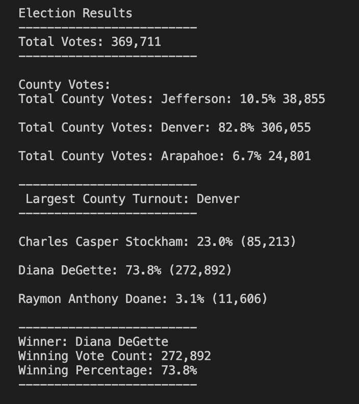
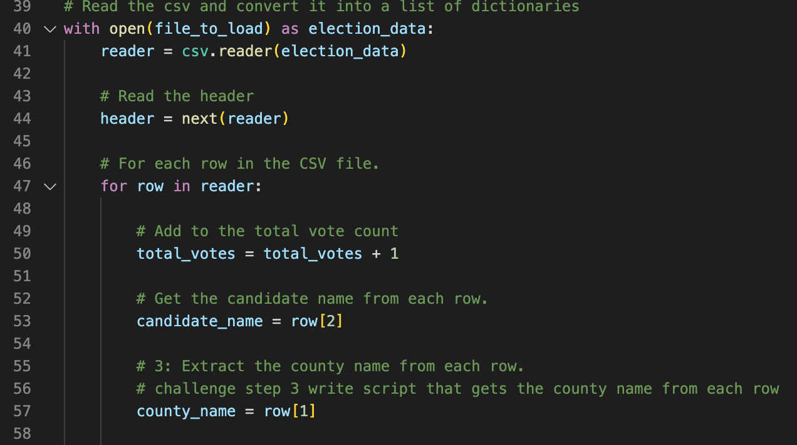

# **Election_Analysis**

## **Purpose**
The purpse of this assignment was to help a Colorado board of elections employee complete and audit for the U.S. congressional precinct in Colorado. The second part of this project was to help the Colorado board of elections employee collect additional information regarding county votes.

### **Goal**
1. Calculate the total the number of votes cast
2. Calculate the voter turnout for each county
3. Calculate the percentage of votes from each county out of the total count
4. Determine the county with the highest turnout
5. Obtain a list of candidate that received votes
6. Caluculate the total numberof votes per candidate
7. Calculate the percetage of votes for each cadidate
8. Determine the winner of the election based on the popular vote

## **Resources**
-Data Source: Election_results.csv
-Software: Python, Visual Studio Code

## **Summary**
### **Results**
The anaylsis of the election showed that:
- There were 369,711 votes cast in the election.
- County vote breakdown:
  - Total County Votes: Jefferson: 10.5% 38,855
  - Total County Votes: Denver: 82.8% 306,055
  - Total County Votes: Arapahoe: 6.7% 24,801
- County that had the largest number of votes: Denver
- The candidates were:
  - Charles Casper Stockham
  - Diana DeGette who received
  - Raymon Anthony Doane
- The candidate results were:
  - Charles Casper Stockham who received 23.0% of the vote and 85,213 number of votes.
  - Diana DeGette who received 73.8% of the vote and 272,892 number of votes.
  - Raymon Anthony Doane who received 3.1% of the vote and 11,606 number of votes.
- The winner of the Election was:
  - Diana DeGette who received 73.8% of the vote and 272,892 number of votes.

See image below:

Writing a script with Python was successfully able to audit and calculate the results of the congressional district. The script, with modification to the code, could be applied to other elections to speed up the audit process. One example could be for senatorial districts. The code could almost be kept the same and applied to different data file. Modifications in the code would be needed for opening and looping through the new data file as well where variables lie within the data file. An example of this in the code would be lines 40, 41, 53, and 57.

The part of the script that calculates county votes could be included or removed depending if the senatorial election file contained this information or if it was needed.

A second application of this code could be for local elections. In this case more modifications to the code would be needed. The code would neeed to be linked to the new data file and again variables would need to be adjusted to reflect where they appear in the data file. The county count could be included or removed depending on what was needed for the election.

